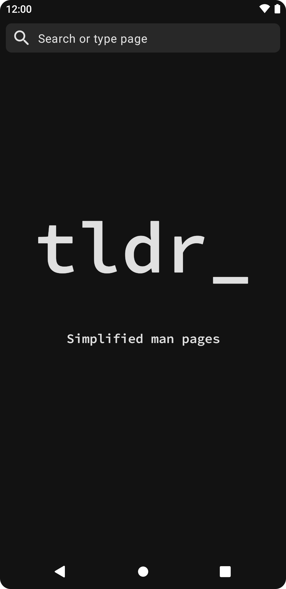
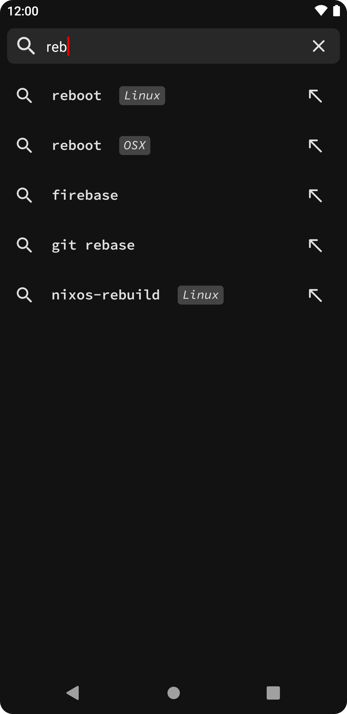
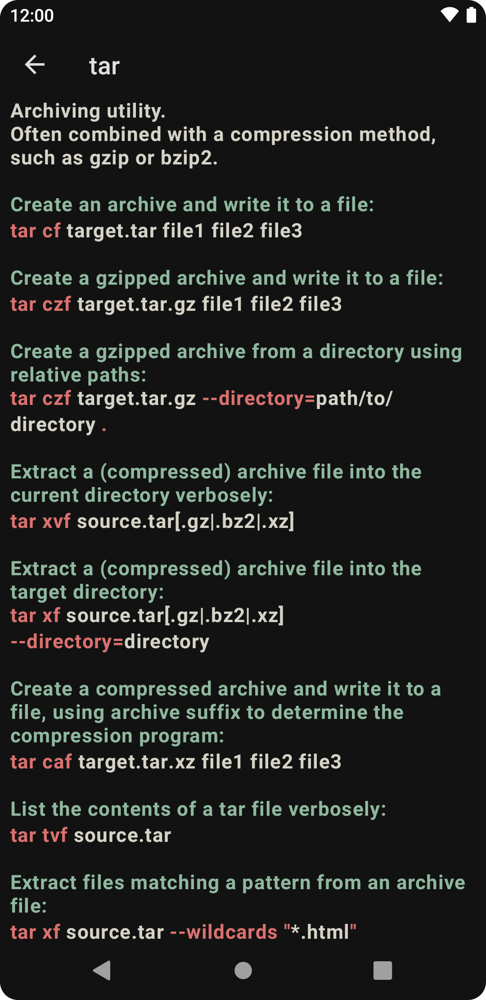

tldr
====

An Android app for searching the simplified man pages provided by [tldr-pages](https://github.com/tldr-pages/tldr)

## Screenshots

    
    
    

## Licence
**tldr** is is distributed under the terms of the Apache License (Version 2.0). See the
[license](LICENSE) for more information.
